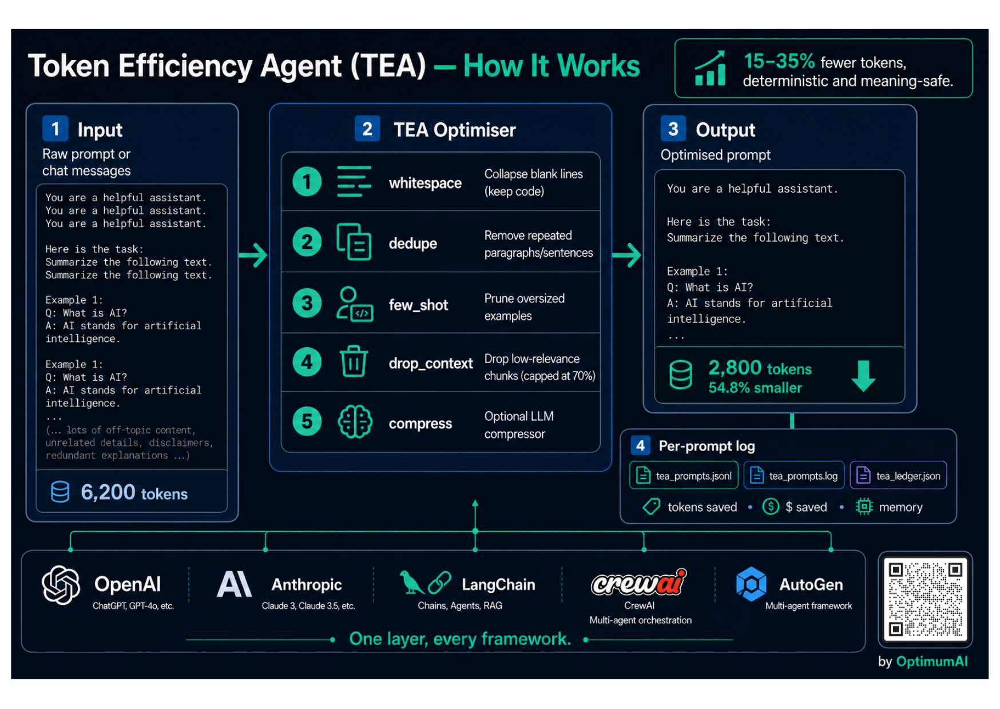

<div align="center">

# Token Efficiency Agent (TEA)

**Measure and cut wasted tokens in any LLM prompt, before it reaches the provider.**

[](LICENSE)
[](https://www.python.org)
[](https://github.com/Optimumailabs/Token-Efficiency-Agent)
[](https://github.com/Optimumailabs/Token-Efficiency-Agent)
[](vscode-extension/)
[](pyproject.toml)

*Deterministic by default. Optional LLM compressor for deeper savings. Adapters for OpenAI, Anthropic, LangChain, CrewAI, and AutoGen. Per-prompt logging built in.*

<br>



</div>

---

## Table of contents

- [The problem](#the-problem)
- [TEA in one minute](#tea-in-one-minute)
- [With vs without TEA](#with-vs-without-tea)
- [Quick start (three paths)](#quick-start-three-paths)
  - [Path A: Python package](#path-a-python-package)
  - [Path B: Claude Code plugin](#path-b-claude-code-plugin)
  - [Path C: VS Code extension](#path-c-vs-code-extension)
- [What is inside](#what-is-inside)
- [Framework integrations](#framework-integrations)
- [Transforms: which one does what](#transforms-which-one-does-what)
- [Logging](#logging)
- [Command line](#command-line)
- [How it works (the math)](#how-it-works-the-math)
- [Safety](#safety)
- [FAQ](#faq)
- [Troubleshooting](#troubleshooting)
- [Testing](#testing)
- [Project layout](#project-layout)
- [Contributing](#contributing)
- [License](#license)

---

## The problem

A typical production prompt ships 40 to 65 per cent more tokens than the model
actually uses. The waste comes from duplicate retrieved passages, off-topic
context, oversized few-shot blocks, and boilerplate. It is pure cost and added
latency, and it is usually invisible: token counts and bills both rise together
without pointing at the cause.

TEA finds the waste, removes it, and reports exactly what it changed and how
many tokens it saved. It never changes what the model is being asked to do.

---

## TEA in one minute

```python
import tea

result = tea.optimize(long_prompt, query="the user question", model="gpt-4o")
print(result.optimized)      # the shorter prompt
print(result.summary())      # what changed, tokens and dollars saved
```

```text
TEA optimisation (gpt-4o): 6,200 -> 2,800 tokens (54.8% reduction, 3,400 saved).
  - dedupe: saved 180 tokens. Removed 1 duplicate paragraph(s).
  - drop_context: saved 3,220 tokens. Dropped context chunks with low query overlap.
```

---

## With vs without TEA

| Capability | Without TEA | With TEA |
|---|---|---|
| Knowing how much of a prompt is wasted | Invisible; you see only the bill | A score per request and a per-prompt log |
| Removing duplicate retrieved passages | Manual | Automatic, deterministic |
| Dropping context the model ignores | Manual guesswork | Relevance-scored, capped, reversible |
| Trimming oversized few-shot blocks | Manual | Automatic |
| Cost attribution per prompt | None | Dollars saved per call + running ledger |
| Works across providers | Re-implement per SDK | One layer: OpenAI, Anthropic, LangChain, CrewAI, AutoGen |
| Quality risk from optimisation | Unknown | Deterministic transforms are meaning-preserving; LLM compression is opt-in and bounded |

---

## Quick start (three paths)

### Path A: Python package

```bash
# From PyPI (once published)
pip install token-efficiency-agent

# Straight from GitHub, no release needed
pip install "git+https://github.com/Optimumailabs/Token-Efficiency-Agent.git"

# Optional extras
pip install "token-efficiency-agent[all]"   # tiktoken (exact tokens) + psutil (RSS memory)
```

```python
import tea
result = tea.optimize(messages, model="gpt-4o")   # str or chat messages
cheaper = result.optimized
```

### Path B: Claude Code plugin

This repo is a Claude Code plugin. In Claude Code, run:

```text
/plugin marketplace add Optimumailabs/Token-Efficiency-Agent
/plugin install token-efficiency-agent@token-efficiency-agent
```

Then ask Claude to "score this prompt" or "optimise this prompt and show tokens
saved", or call it directly with `/token-efficiency-agent:token-efficiency-agent`.
Pasting the bare repo URL into the chat does not install anything; the two
commands above are the supported flow.

### Path C: VS Code extension

Install the extension in [`vscode-extension/`](vscode-extension/). It adds
**TEA: Optimise selected prompt** and **TEA: Score selected prompt** commands
(also on the right-click menu). It wraps the Python package, so install that
too. Marketplace publishing steps are in the
[extension README](vscode-extension/README.md).

---

## What is inside

| Component | What it is |
|---|---|
| `tea` package | The optimiser, scorer, token counter, and logging. Zero required deps. |
| 6 transforms | route, whitespace, dedupe, few_shot, drop_context, compress |
| 5 framework adapters | OpenAI, Anthropic, LangChain, CrewAI, AutoGen |
| 3 console commands | `tea-optimize`, `tea-score`, `tea-dashboard` |
| Per-prompt logging | JSONL + human log + cumulative savings ledger (with confidence intervals) + input/output cost + memory stats |
| Observability dashboard | self-contained HTML: token/cost charts, prompt history, red/green diffs |
| Cache + measurement controls | `preserve_prefix` for KV-cache hits, `holdout` control group for honest measurement |
| Versioned templates | per-`template_id` history with diffs between iterations |
| Claude Code skill | `skills/token-efficiency-agent/SKILL.md` |
| VS Code extension | `vscode-extension/` |
| 5 test suites | functional, edge case, logging, tier-1 deep, observability |

---

## Framework integrations

| Framework | Import | One-liner |
|---|---|---|
| OpenAI SDK | `from tea.integrations.openai_wrap import wrap_openai` | `client = wrap_openai(OpenAI())` |
| Anthropic SDK | `from tea.integrations.anthropic_wrap import wrap_anthropic` | `client = wrap_anthropic(Anthropic())` |
| LangChain | `from tea.integrations.langchain_cb import TEAOptimizer` | `chain = TEAOptimizer(model_name="gpt-4o") \| model` |
| CrewAI | `from tea.integrations.crewai_hook import optimize_agents, optimize_tasks` | `optimize_agents(agents); optimize_tasks(tasks)` |
| AutoGen | `from tea.integrations.autogen_hook import TEAMessageTransform` | add `TEAMessageTransform()` to a `TransformMessages` capability |

```python
from openai import OpenAI
from tea.integrations.openai_wrap import wrap_openai

client = wrap_openai(OpenAI(), log="tea_logs")   # every call optimised + logged
client.chat.completions.create(model="gpt-4o", messages=[...])
```

No framework is a hard dependency. Each adapter imports its framework only when
you use it.

---

## Transforms: which one does what

| Transform | Default | Meaning-safe | What it does |
|---|---|---|---|
| `route` | on | yes | Classify each block as JSON, code, or prose, then apply the right compressor: minify JSON (key order preserved), strip whole-line code comments by language. Leaves prose to the transforms below. |
| `whitespace` | on | yes | Collapse blank-line runs and trailing spaces; preserves code fences. |
| `dedupe` | on | yes | Drop duplicate paragraphs and repeated sentences. |
| `few_shot` | on | yes | Prune the back half of an oversized few-shot block. |
| `drop_context` | opt-in | mostly | Drop context chunks with low query overlap. Never empties context; removes at most 70% per pass. |
| `compress` | opt-in | depends on your model | Route text through a caller-supplied LLM compressor, with a safety guard. |

```python
# safe set is the default
tea.optimize(prompt, query=q)

# add context dropping and the LLM compressor
tea.optimize(prompt, query=q, enable=tea.AGGRESSIVE_TRANSFORMS, compressor=my_fn)
```

Expect 15 to 35 per cent reduction on bloated prompts from the deterministic
transforms alone. The LLM compressor goes further at the cost of one model call.

### Keep cached prefixes intact

Most providers only give a prompt-cache discount when the prompt *prefix*
matches byte-for-byte. Rewriting that prefix can cost more than it saves. Pass
`preserve_prefix` with your stable leading region (a system block, long fixed
instructions) and TEA holds it out of every transform, optimising only the
tail:

```python
tea.optimize(prompt, query=q, preserve_prefix=SYSTEM_PROMPT)
```

### Measure honestly, do not guess

Output-token savings are counterfactual: you never see what the model would
have written for the longer prompt. To get real numbers, hold out a control
group with `holdout` (a fraction of calls left unoptimised and tagged
`:control` in the log):

```python
tea.optimize(prompt, query=q, holdout=0.1)   # ~10% kept as a control
```

The ledger then reports `savings_kind: "measured"` once a control group
exists, plus a mean reduction with a 95% confidence interval
(`reduction_ci95`). With no control group it honestly labels the figure
`"estimated"`.

---

## Logging

Turn it on and TEA appends a structured record for every optimise call: the
original prompt, the optimised prompt, tokens before and after, tokens saved,
reduction percent, dollars saved, which transforms fired, process memory, and a
running savings ledger.

```python
import tea
tea.enable_logging("tea_logs")          # or set the TEA_LOG_DIR env var
tea.optimize(prompt, query="...")        # logged automatically
```

| File | Contents |
|---|---|
| `tea_prompts.jsonl` | One JSON record per call. Machine-readable. |
| `tea_prompts.log` | The same records formatted for humans. |
| `tea_ledger.json` | Running totals: calls, tokens saved, dollars saved. |

```json
{
  "ts": "2026-06-18T20:03:29.787+00:00",
  "source": "openai",
  "model": "gpt-4o",
  "tokens_before": 6200, "tokens_after": 2800,
  "tokens_saved": 3400, "reduction_pct": 54.8, "usd_saved": 0.0085,
  "transforms": [{"name": "drop_context", "saved": 3400, "note": "..."}],
  "memory": {"rss_bytes": 84213760, "peak_kib": 512.4},
  "ledger": {"calls": 12, "tokens_saved": 41000, "usd_saved": 0.102},
  "original_prompt": "...", "optimized_prompt": "..."
}
```

Logging is off by default, never raises into your call path, and is
thread-safe. Per-call control: `log=True` (default dir), `log="/dir"` (one-off),
`log=False` (never). Every adapter and the CLI accept the same `log=` argument.

---

## Command line

```bash
# Score a prompt
tea-score    --prompt-file prompt.txt --query "..." --model gpt-4o

# Optimise a prompt (safe transforms)
tea-optimize --prompt-file prompt.txt --query "..."

# Add context dropping, and log the run
tea-optimize --prompt-file prompt.txt --query "..." --aggressive --log tea_logs

# Optimise a chat-messages JSON file
tea-optimize --messages-file chat.json --model gpt-4o

# Build the HTML observability dashboard from a log
tea-dashboard --log tea_logs --out report.html
```

---

## Observability dashboard

`tea-dashboard` turns a log into a single self-contained HTML page (inline SVG,
no server, no dependencies):

```bash
tea-dashboard --log tea_logs --out report.html
```

It shows headline cards (calls, tokens before/after, tokens saved, dollars
saved, optimised vs control), input and output token charts, cumulative
dollars saved, and a prompt-history table. Each row expands to a word-level
**red/green diff** of the original vs optimised prompt: red struck-through text
was removed, green text was added.

### Cost: both sides of the bill

Output tokens are the expensive side (GPT-4o: $2.50 per 1M input, $10.00 per
1M output). Pass `output_tokens=` so the log prices both:

```python
tea.optimize(prompt, query=q, output_tokens=180)   # logs input + output cost
```

Without it, output cost is recorded as `estimated`. TEA only shrinks the input
prompt directly, so input cost is what it reduces; output is shown for the full
picture.

### Versioned prompt templates

Pass `template_id=` to keep one maintained template with a version history.
Each iteration that changes the optimised prompt appends a new version with the
diff from the previous one, persisted under the log directory and shown in the
dashboard.

```python
tea.optimize(prompt, query=q, template_id="support-bot")   # v1, v2, v3, ...
```

---

## How it works (the math)

TEA assigns each request a composite score:

```
S(P) = a * TokenEff + b * Quality - c * (Cost / Cost_max) - d * (1 - Util)
```

where `TokenEff` is quality-weighted output per input token, `Util` is the
fraction of context the model actually used, and the weights `(a, b, c, d)` sum
to 1. The optimiser then searches the safe transforms for the variant that
raises `S` without dropping quality below a floor.

The relevance signal in this release is lexical overlap between each context
chunk and the query. It is a coarse but safe proxy for attention: it errs
toward keeping a chunk rather than dropping a useful one. The full derivation,
including the closed-model attention path, is in [`docs/MATH.md`](docs/MATH.md).

---

## Safety

- Deterministic transforms never change meaning. They remove repetition,
  boilerplate, and clearly off-topic context.
- `drop_context` keeps the highest-overlap chunk and removes at most 70 per cent
  of the context in a single pass, so a misjudgement by the lexical proxy
  cannot gut the prompt.
- The LLM compressor is opt-in and bounded. Its output is rejected if it
  collapses the text below a floor or fails to shrink it.
- If a compressor raises, TEA catches it and keeps the deterministic result.
- Logging failures are swallowed; they never break optimisation.

---

## FAQ

**Does TEA call my model?** No. The deterministic transforms are pure Python.
Only the optional `compress` transform calls a model, and only the one you pass
in.

**Will it change my prompt's meaning?** The default transforms are
meaning-preserving (dedupe, whitespace, few-shot pruning). `drop_context` and
`compress` are opt-in and bounded.

**Does it work with Claude / Anthropic?** Yes, via the adapter. Anthropic has no
public tokenizer, so token counts use a close approximation; relative
before/after numbers stay valid.

**What if tiktoken is not installed?** TEA falls back to a whitespace-based
token estimate and flags it in the output. Install `tiktoken` for exact counts.

**Is there a hard dependency on LangChain / OpenAI / etc.?** No. Adapters import
their framework lazily, only when used.

**How much does it save?** 15 to 35 per cent on bloated prompts from the
deterministic transforms; more with the LLM compressor. Savings depend entirely
on how wasteful the input is.

---

## Troubleshooting

| Symptom | Cause | Fix |
|---|---|---|
| `reduction_pct` is 0 | Prompt was already tight | Nothing to do; that is a good sign |
| Token counts look approximate | `tiktoken` not installed | `pip install tiktoken` |
| `memory.rss_bytes` is null in logs | `psutil` missing and not on Linux | `pip install psutil` |
| `drop_context` did nothing | No `query` passed | Pass `query=` so relevance can be scored |
| Console command not found | Package not installed, or wrong env | `pip install token-efficiency-agent` in the active env |

### Uninstall

```bash
pip uninstall token-efficiency-agent
# Claude Code plugin:
/plugin uninstall token-efficiency-agent@token-efficiency-agent
```

---

## Testing

```bash
python -m tea._selftest      # core functional checks
python -m tea._edgetest      # edge cases: inputs, pipeline, concurrency
python -m tea._logtest       # logging checks
python -m tea._tier1test     # routing, cache-prefix, measurement integrity
python -m tea._obstest       # cost, diffs, templates, dashboard
```

---

## Project layout

```
.
├── pyproject.toml               pip-installable metadata + console scripts
├── README.md                    this file
├── LICENSE  CHANGELOG.md  CONTRIBUTING.md  SECURITY.md
├── .claude-plugin/              Claude Code plugin manifests
│   ├── plugin.json
│   └── marketplace.json
├── skills/
│   └── token-efficiency-agent/SKILL.md
├── docs/                        deeper guides (math, integrations, logging)
├── .github/workflows/publish.yml
├── vscode-extension/            VS Code editor extension
├── scripts/                     repo-local CLIs (skill fallback)
└── tea/                         the importable package
    ├── __init__.py  optimizer.py  tokens.py  logbook.py  cli.py
    ├── difftool.py  templates.py  dashboard.py
    ├── _selftest.py  _edgetest.py  _logtest.py  _tier1test.py  _obstest.py
    └── integrations/            openai, anthropic, langchain, crewai, autogen
```

---

## Contributing

See [CONTRIBUTING.md](CONTRIBUTING.md). In short: run the three test suites, keep
the deterministic transforms meaning-safe, and add a test for any new transform
or adapter.

Security reports: see [SECURITY.md](SECURITY.md).

---

## License

MIT. See [LICENSE](LICENSE). Built by [Optimum AI](https://www.optimumai.in).
